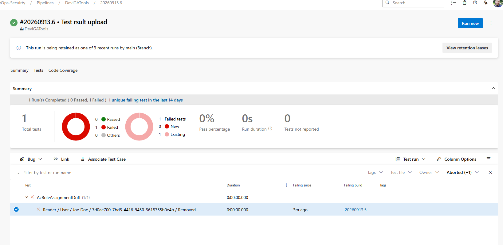
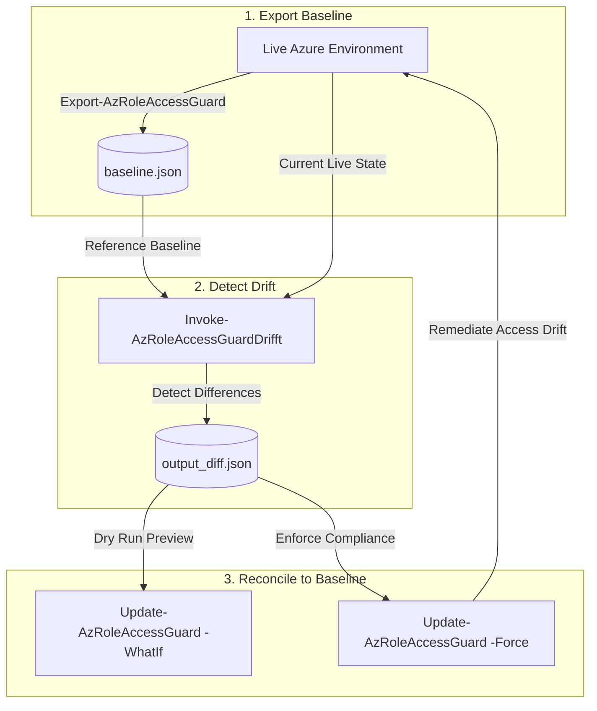

# PowerShell.IGA.AccessGuard

An Identity Governance and Administration (IGA) PowerShell module for exporting, monitoring, detecting drift, and reconciling Azure Role-Based Access Control (RBAC) role assignments across Subscriptions and Management Groups.


## Table of Contents

- [Key Features](#-key-features)
- [Prerequisites & Requirements](#-prerequisites--requirements)
- [Installation](#installation)
- [Exported Functions](#-exported-functions)
- [Export-AzRoleAccessGuard](#1-export-azroleaccessguard)
- [Invoke-AzRoleAccessGuardDrifft](#2-invoke-azroleaccessguarddrifft)
- [Publish JUnit results in Azure DevOps](#publish-junit-results-in-azure-devops)
- [Compare-AzRoleAccessGuardExport](#3-compare-azroleaccessguardexport)
- [Update-AzRoleAccessGuard](#4-update-azroleaccessguard)
- [Clear-AzRoleOrphaned](#5-clear-azroleorphaned)
- [Governance Workflow Example](#-governance-workflow-example)

## 🚀 Key Features

- **Snapshot Export**: Export live Azure RBAC role assignments across Management Groups and Subscriptions into JSON, HTML, CSV, or deployable AVM-based Bicep.
- **Drift Detection**: Compare current Azure access against a reference baseline snapshot and produce detailed drift reports in Terminal, JSON, HTML, CSV, or JUnit XML (ideal for CI/CD pipelines).
- **Automated Remediation**: Reconcile detected access drift by granting missing role assignments or revoking unauthorized access.
- **Orphaned Access Cleanup**: Identify and clean up orphaned role assignments where security principals no longer exist in Microsoft Entra ID.

---

## 📋 Prerequisites & Requirements

- **PowerShell**: 5.1 (Desktop) or PowerShell 7+ (Core)
- **Required Modules**:
  - `Az.Accounts` (>= 15.2)
  - `Az.Resources` (>= 15.2)

## Installation

Install [PowerShell.IGA.AccessGuard from the PowerShell Gallery](https://www.powershellgallery.com/packages/PowerShell.IGA.AccessGuard)
for the current user, including its required modules:

```powershell
Install-Module -Name PowerShell.IGA.AccessGuard -Repository PSGallery -Scope CurrentUser -IncludeDependencies
Import-Module -Name PowerShell.IGA.AccessGuard
```

---

## 🛠️ Exported Functions

### 1. `Export-AzRoleAccessGuard`
Exports a snapshot of active Azure RBAC role assignments across Subscriptions and Management Groups. Bicep output uses the AVM role-assignment modules and omits orphaned principals and assignments with missing or unknown role names.

#### Syntax
```powershell
Export-AzRoleAccessGuard
    [-OutputFormat <String>]
    [-OutputPath <String>]
    [-SubscriptionOnly]
    [-ManagementGroupOnly]
    [-IncludeInherited]
```

#### Parameters
- `-OutputFormat`: Format of the output snapshot (`Json`, `Html`, `Csv`, `Bicep`). Default is `Json`.
- `-OutputPath`: Destination file path without file extension. Default is `./output`.
- `-SubscriptionOnly`: Export role assignments for Subscriptions only.
- `-ManagementGroupOnly`: Export role assignments for Management Groups only.
- `-IncludeInherited`: Include role assignments inherited from parent scopes.

#### Examples
```powershell
# Export all Subscriptions and Management Groups baseline to JSON
Export-AzRoleAccessGuard -OutputFormat Json -OutputPath "C:\baselines\azure-rbac-baseline"

# Export Subscriptions only into an HTML report
Export-AzRoleAccessGuard -OutputFormat Html -SubscriptionOnly -OutputPath "C:\reports\sub-rbac"

# Export Management Group and Subscription assignments as an AVM-based Bicep deployment
Export-AzRoleAccessGuard -OutputFormat Bicep -OutputPath "C:\baselines\azure-rbac"
```

The generated Bicep template targets the tenant scope and can be deployed with
`az deployment tenant create --location <location> --template-file C:\baselines\azure-rbac.bicep`.
It references the AVM [management-group scope module](https://github.com/Azure/bicep-registry-modules/tree/main/avm/res/authorization/role-assignment/mg-scope)
and [subscription scope module](https://github.com/Azure/bicep-registry-modules/tree/main/avm/res/authorization/role-assignment/sub-scope),
using versions `0.1.2` and `0.1.1`, respectively. Inherited assignments are emitted once at their
source scope. The template includes Bicep metadata for the generating tool and UTC export time,
separate `// MARK:` sections for management-group and subscription assignments, and one AVM module
per deployable assignment. Orphaned principals and assignments with missing or unknown role names
are omitted; AVM telemetry is disabled in generated modules.

Example output (IDs and timestamp are illustrative):

```bicep
targetScope = 'tenant'

metadata generatedBy = 'PowerShell.IGA.AccessGuard'
metadata exportedAtUtc = '2026-10-02T20:10:14Z'

// MARK: Management Group Role Assignments

module mod_role_assignment_mg_reader_aaaaaaaa_aaaa_aaaa_aaaa_aaaaaaaaaaaa 'br/public:avm/res/authorization/role-assignment/mg-scope:0.1.2' = {
    scope: managementGroup('Platform')
    params: {
        principalId: 'aaaaaaaa-aaaa-aaaa-aaaa-aaaaaaaaaaaa'
        roleDefinitionIdOrName: 'Reader'
        managementGroupId: 'Platform'
        principalType: 'Group'
        enableTelemetry: false
    }
}

// MARK: Subscription Role Assignments

module mod_role_assignment_sub_contributor_bbbbbbbb_bbbb_bbbb_bbbb_bbbbbbbbbbbb 'br/public:avm/res/authorization/role-assignment/sub-scope:0.1.1' = {
    scope: subscription('cccccccc-cccc-cccc-cccc-cccccccccccc')
    params: {
        principalId: 'bbbbbbbb-bbbb-bbbb-bbbb-bbbbbbbbbbbb'
        roleDefinitionIdOrName: 'Contributor'
        principalType: 'ServicePrincipal'
        enableTelemetry: false
    }
}
```

---

### 2. `Invoke-AzRoleAccessGuardDrifft`
Compares current live Azure RBAC role assignments against a reference baseline file to identify permission drift (added, removed, or modified assignments).

#### Syntax
```powershell
Invoke-AzRoleAccessGuardDrifft
    [-ReferenceFile] <String>
    [[-OutputPath] <String>]
    [[-OutputFormat] <String>]
```

#### Parameters
- `-ReferenceFile`: Path to the baseline snapshot file (JSON) generated by `Export-AzRoleAccessGuard`.
- `-OutputPath`: Destination file path for saving the drift report without extension. Default is `./output_diff`.
- `-OutputFormat`: Drift report output format (`Terminal`, `Json`, `Html`, `Csv`, `JUnit`, `Bicep`). Default is `Json`.

#### Examples
```powershell
# Display drift report directly in the terminal table view
Invoke-AzRoleAccessGuardDrifft -ReferenceFile "C:\baselines\azure-rbac-baseline.json" -OutputFormat Terminal

# Output JUnit XML report for Azure DevOps or GitHub Actions CI/CD pipelines
Invoke-AzRoleAccessGuardDrifft -ReferenceFile "C:\baselines\azure-rbac-baseline.json" -OutputFormat JUnit -OutputPath "./drift-results"

# Export AVM Bicep modules for baseline assignments missing from Azure
Invoke-AzRoleAccessGuardDrifft -ReferenceFile "C:\baselines\azure-rbac-baseline.json" -OutputFormat Bicep -OutputPath "./drift-to-add"
```

Bicep drift output uses the same AVM management-group (`0.1.2`) and subscription (`0.1.1`)
modules as the full export. It includes missing baseline assignments to add. Assignments present in
Azure but absent from the baseline require removal; because these AVM modules only create role
assignments, those changes are excluded and reported as a warning.

#### Publish JUnit results in Azure DevOps

On an Azure-authenticated agent with the module installed, generate the JUnit report and publish it
with `PublishTestResults@2`:

```yaml
trigger:
- main

pool:
    vmImage: ubuntu-latest

steps:
- pwsh: |
        $driftParams = @{
            ReferenceFile = "$(Build.SourcesDirectory)/baseline.json"
            OutputFormat = 'JUnit'
            OutputPath = "$(Build.SourcesDirectory)/output_diff"
        }
        Invoke-AzRoleAccessGuardDrifft @driftParams
    displayName: Generate JUnit drift results

- task: PublishTestResults@2
    condition: succeededOrFailed()
    inputs:
        testResultsFormat: JUnit
        testResultsFiles: output_diff.xml
        searchFolder: '$(Build.SourcesDirectory)'
        failTaskOnFailedTests: false
```

The published drift findings appear in the Azure DevOps Tests view:



---

### 3. `Compare-AzRoleAccessGuardExport`
Compares two previously exported role assignment JSON files, for example a full export (`-IncludeInherited`) against a baseline export, without querying Azure.

#### Syntax
```powershell
Compare-AzRoleAccessGuardExport
    [-FullExportFile] <String>
    [-ExportFile] <String>
    [[-OutputPath] <String>]
    [[-OutputFormat] <String>]
```

#### Parameters
- `-FullExportFile`: Path to the full export file (JSON) treated as the current/actual state.
- `-ExportFile`: Path to the baseline export file (JSON) treated as the reference/desired state.
- `-OutputPath`: Destination file path for saving the comparison report without extension. Default is `./output_export_diff`.
- `-OutputFormat`: Comparison report output format (`Terminal`, `Json`, `Html`, `Csv`, `JUnit`). Default is `Json`.

#### Examples
```powershell
# Compare a full export against the baseline export and print results to the terminal
Compare-AzRoleAccessGuardExport -FullExportFile "C:\exports\full-export.json" -ExportFile "C:\baselines\azure-rbac-baseline.json" -OutputFormat Terminal

# Write an HTML comparison report
Compare-AzRoleAccessGuardExport -FullExportFile "C:\exports\full-export.json" -ExportFile "C:\baselines\azure-rbac-baseline.json" -OutputFormat Html -OutputPath "./export-comparison"
```

---

### 4. `Update-AzRoleAccessGuard`
Reconciles Azure RBAC assignments by applying corrections specified in a drift report file (`output_diff.json`). Adds missing role assignments and revokes unauthorized ones.

#### Syntax
```powershell
Update-AzRoleAccessGuard
    [[-DriftFile] <String>]
    [-Force]
    [-WhatIf]
    [-Confirm]
```

#### Parameters
- `-DriftFile`: Path to the drift report JSON file produced by `Invoke-AzRoleAccessGuardDrifft`. Default is `./output_diff.json`.
- `-Force`: Suppresses interactive confirmation prompts for unattended pipelines.
- `-WhatIf`: Previews changes that would be executed without modifying Azure resources.
- `-Confirm`: Prompts for explicit confirmation before performing actions.

#### Examples
```powershell
# Preview reconciliation actions without making actual changes
Update-AzRoleAccessGuard -DriftFile "./output_diff.json" -WhatIf

# Enforce desired state non-interactively
Update-AzRoleAccessGuard -DriftFile "./output_diff.json" -Force
```

---

### 5. `Clear-AzRoleOrphaned`
Identifies and optionally removes orphaned role assignments in Azure (assignments pointing to deleted or missing Entra ID principals).

#### Syntax
```powershell
Clear-AzRoleOrphaned
    [-Remove]
    [-GenerateReport]
    [-OutputFormat <String>]
    [-OutputPath <String>]
    [-WhatIf]
    [-Confirm]
```

#### Parameters
- `-Remove`: Enables removal of identified orphaned role assignments. When omitted, runs in report-only dry-run mode.
- `-GenerateReport`: Exports the orphaned role assignments report file.
- `-OutputFormat`: Format for the report (`Json`, `Html`, `Csv`, `JUnit`). Default is `Json`.
- `-OutputPath`: Base output file path without extension. Default is `.\output_unknow`.

#### Examples
```powershell
# Generate an HTML report of orphaned role assignments without removing them
Clear-AzRoleOrphaned -GenerateReport -OutputFormat Html -OutputPath "./orphaned_report"

# Remove all orphaned role assignments interactively
Clear-AzRoleOrphaned -Remove
```

---

## 🔄 Governance Workflow Example



1. **Export Baseline**:
   ```powershell
   Export-AzRoleAccessGuard -OutputFormat Json -OutputPath "./baseline"
   ```
2. **Detect Drift**:
   ```powershell
   Invoke-AzRoleAccessGuardDrifft -ReferenceFile "./baseline.json" -OutputFormat Json -OutputPath "./output_diff"
   ```
3. **Reconcile to Baseline**:
   ```powershell
   Update-AzRoleAccessGuard -DriftFile "./output_diff.json" -WhatIf
   Update-AzRoleAccessGuard -DriftFile "./output_diff.json" -Force
   ```
4. **Clean Up Orphaned Assignments**:
   ```powershell
   Clear-AzRoleOrphaned -Remove -GenerateReport -OutputFormat Html
   ```

